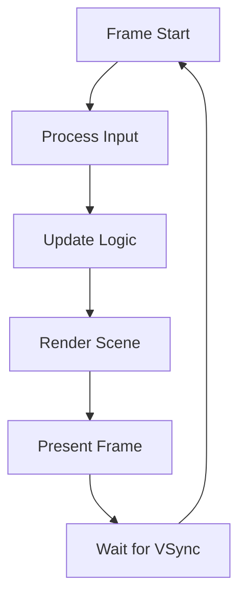

# Game Loop

Understanding Heaps' game loop is fundamental to creating smooth, responsive games. Heaps provides a robust fixed-timestep loop that ensures consistent gameplay across different devices.

## The Update Cycle

Heaps calls your `update()` method at a fixed rate (60 FPS by default):

```haxe
class Main extends hxd.App {
    override function update(dt:Float) {
        // Called 60 times per second
        // dt = time since last update in seconds
        // Usually ~0.016667 (1/60)
    }
}
```

## Fixed vs Variable Timestep

Heaps uses a **fixed timestep with interpolation**:

- Logic updates at exactly 60 FPS
- Rendering can run faster (144Hz, etc.)
- Visual interpolation ensures smooth motion

This provides:
- ✅ Deterministic physics
- ✅ Consistent gameplay
- ✅ Smooth visuals on high-refresh displays

## Delta Time Usage

Always use delta time for movement and animations:

```haxe
class Player extends h2d.Object {
    var speed = 200.0; // pixels per second
    
    public function update(dt:Float) {
        // CORRECT: Frame-rate independent
        x += speed * dt;
        
        // WRONG: Tied to frame rate
        x += 3.33; // Don't do this!
    }
}
```

## The Complete Loop

Here's what happens each frame:



## Customizing the Loop

### Change Update Rate

```haxe
class Main extends hxd.App {
    override function init() {
        hxd.Timer.wantedFPS = 120; // 120 FPS logic
        
        // Or for slower games:
        hxd.Timer.wantedFPS = 30; // 30 FPS logic
    }
}
```

### Separate Update and Render

```haxe
class Main extends hxd.App {
    var accumulator = 0.0;
    var fixedTimestep = 1.0 / 60.0; // 60 FPS
    
    override function update(dt:Float) {
        accumulator += dt;
        
        // Fixed timestep updates
        while (accumulator >= fixedTimestep) {
            fixedUpdate(fixedTimestep);
            accumulator -= fixedTimestep;
        }
        
        // Render with interpolation
        var alpha = accumulator / fixedTimestep;
        render(alpha);
    }
    
    function fixedUpdate(dt:Float) {
        // Physics, game logic
    }
    
    function render(alpha:Float) {
        // Visual interpolation
    }
}
```

## Performance Monitoring

### Built-in FPS Counter

```haxe
override function init() {
    #if debug
    new h2d.FPS(s2d); // Top-left FPS display
    #end
}
```

### Custom Performance Metrics

```haxe
class PerformanceMonitor extends h2d.Text {
    var updateTime = 0.0;
    var renderTime = 0.0;
    
    public function new(parent) {
        super(hxd.res.DefaultFont.get(), parent);
    }
    
    override function sync(ctx:h2d.RenderContext) {
        text = 'Update: ${Math.round(updateTime)}ms
Render: ${Math.round(renderTime)}ms
Draw Calls: ${ctx.drawCalls}
Triangles: ${ctx.triangles}';
        
        super.sync(ctx);
    }
}
```

## Frame Timing

### Measure Update Time

```haxe
class Main extends hxd.App {
    var stats : PerformanceStats;
    
    override function update(dt:Float) {
        var start = haxe.Timer.stamp();
        
        // Game logic here
        gameUpdate(dt);
        
        var elapsed = haxe.Timer.stamp() - start;
        stats.recordUpdate(elapsed * 1000); // Convert to ms
    }
}
```

### Handle Slow Frames

```haxe
override function update(dt:Float) {
    // Clamp delta time to prevent spiral of death
    dt = Math.min(dt, 1.0 / 30.0); // Max 33ms
    
    // Update with clamped dt
    world.update(dt);
}
```

## Common Patterns

### Time Accumulator

```haxe
class Timer {
    var elapsed = 0.0;
    var duration : Float;
    var onComplete : Void->Void;
    
    public function new(duration:Float, onComplete:Void->Void) {
        this.duration = duration;
        this.onComplete = onComplete;
    }
    
    public function update(dt:Float) : Bool {
        elapsed += dt;
        if (elapsed >= duration) {
            onComplete();
            return true; // Timer finished
        }
        return false;
    }
    
    public function getProgress() : Float {
        return Math.min(elapsed / duration, 1.0);
    }
}
```

### Animation Controller

```haxe
class AnimationController {
    var animations : Map<String, Animation> = [];
    var current : Animation;
    var time = 0.0;
    
    public function update(dt:Float) {
        if (current == null) return;
        
        time += dt;
        
        var frame = Math.floor(time * current.fps);
        if (frame >= current.frames.length) {
            if (current.loop) {
                time = 0;
                frame = 0;
            } else {
                frame = current.frames.length - 1;
                onAnimationComplete();
            }
        }
        
        displayFrame(current.frames[frame]);
    }
}
```

### State Machine with Timing

```haxe
class StateMachine {
    var states : Map<String, State> = [];
    var current : State;
    var stateTime = 0.0;
    
    public function update(dt:Float) {
        stateTime += dt;
        
        if (current != null) {
            current.update(dt, stateTime);
            
            // Check transitions
            var next = current.checkTransitions();
            if (next != null) {
                changeState(next);
            }
        }
    }
    
    function changeState(name:String) {
        if (current != null) {
            current.exit();
        }
        
        current = states.get(name);
        stateTime = 0.0;
        
        if (current != null) {
            current.enter();
        }
    }
}
```

## Best Practices

### 1. Consistent Units
```haxe
// Always use the same time units
class Constants {
    // Speeds in pixels per second
    public static inline var PLAYER_SPEED = 200.0;
    public static inline var BULLET_SPEED = 500.0;
    
    // Durations in seconds
    public static inline var DASH_DURATION = 0.2;
    public static inline var INVINCIBILITY_TIME = 1.0;
}
```

### 2. Frame-Rate Independence
```haxe
// Good: Works at any frame rate
player.x += velocity * dt;
rotation += angularVelocity * dt;
timer += dt;

// Bad: Assumes 60 FPS
player.x += 3;
rotation += 0.1;
timer += 1;
```

### 3. Update Order
```haxe
override function update(dt:Float) {
    // 1. Input
    inputManager.update();
    
    // 2. Game logic
    player.update(dt);
    enemies.update(dt);
    
    // 3. Physics
    physics.simulate(dt);
    
    // 4. Late update (camera, etc)
    camera.lateUpdate(dt);
    
    // 5. UI updates
    ui.update(dt);
}
```

## Debugging the Loop

### Slow Motion
```haxe
class Debug {
    public static var timeScale = 1.0;
}

override function update(dt:Float) {
    dt *= Debug.timeScale; // 0.5 for half speed
    super.update(dt);
}
```

### Frame Stepping
```haxe
class FrameStepper {
    static var paused = false;
    static var step = false;
    
    public static function update(dt:Float) : Float {
        if (hxd.Key.isPressed(hxd.Key.F5)) {
            paused = !paused;
        }
        
        if (paused) {
            if (hxd.Key.isPressed(hxd.Key.F6)) {
                step = true;
            }
            
            if (!step) {
                return 0.0; // No update
            }
            
            step = false;
        }
        
        return dt;
    }
}
```

## Next Steps

Now that you understand the game loop, explore [Scene Management →](scenes.md) to organize your game states.